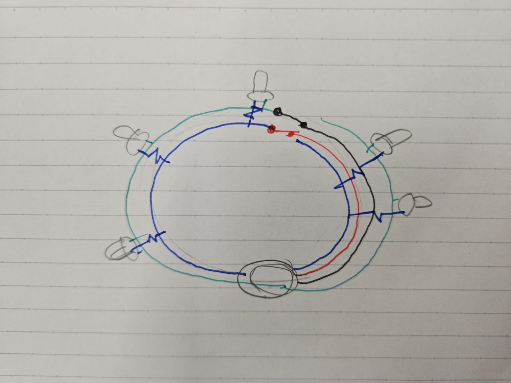
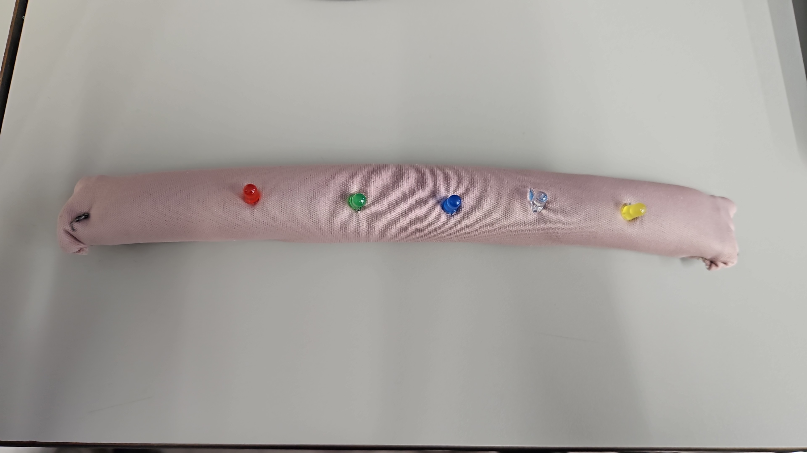
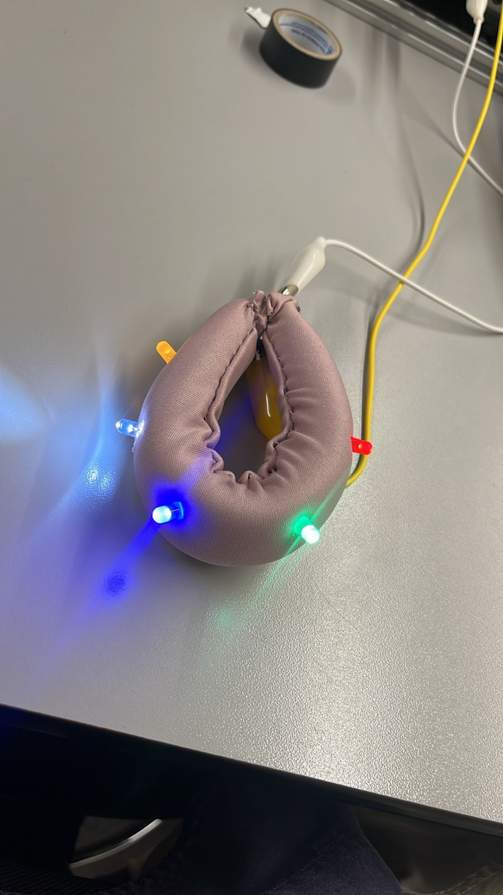

## Evidencia Fotográfica y Validación

El funcionamiento y la integración del circuito en el textil se documentan a continuación, demostrando tanto el proceso de diseño interno como la validación final del brazalete.

**Arquitectura Interna**

> **Esquema de Ruteo:** Boceto analítico que explica cómo corren las conexiones y los hilos conductores por dentro del volumen de la tela, ilustrando la separación de las pistas positivas y negativas para evitar cortocircuitos por doblez.

**Estructura y Ensamblaje**

> **Volumen y Materialidad:** Vista de la morfología cilíndrica del brazalete, mostrando la escala y el uso del forro textil sobre el núcleo de espuma flexible.

**Validación Funcional**

> **Mecanismo Interactivo:** El brazalete cerrado en la muñeca, demostrando el funcionamiento del circuito cerrado a través de los broches de presión. Se observa la calibración lumínica uniforme de los distintos colores de LEDs gracias al cálculo previo de resistencias.

---
