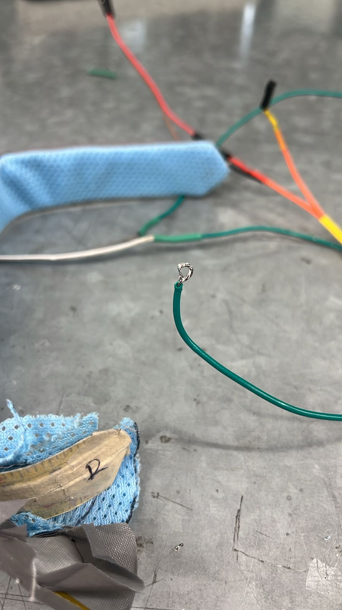
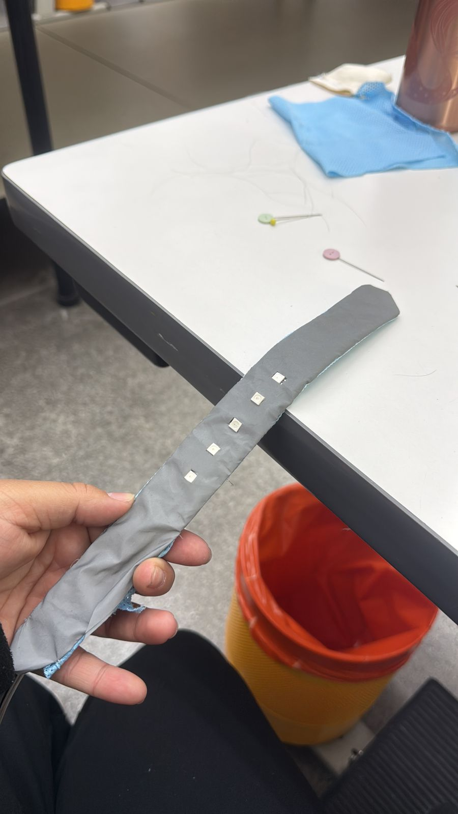
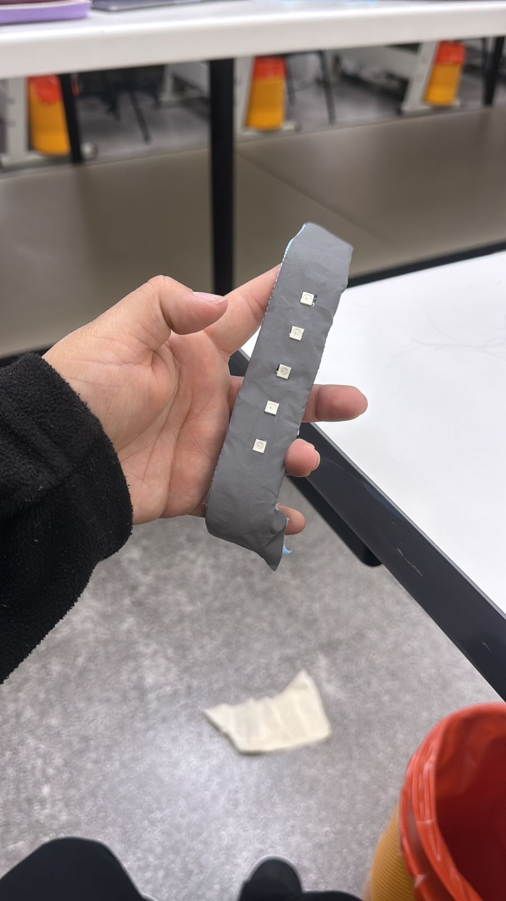

## 4. Evidencia Fotográfica y de Video

La siguiente documentación se centra en el ensamble final del prototipo y la validación de la interfaz lumínica, haciendo énfasis en las soluciones físicas y la lógica de programación.

**Arquitectura Interna y Conexiones**

> **Módulos de Conexión:** Detalle de los cables recubiertos integrados en el textil. Esta solución permitió rutear la señal y la alimentación de la tira NeoPixel interna sin comprometer la flexibilidad de la pulsera ante el impacto mecánico.

**Integración Textil y Switch Analógico**

> **Ensamble Físico:** Vista de la interacción entre la retacería textil que forra la cinta métrica y la electrónica. Se aprecian las áreas diseñadas para alojar la tela conductiva que funciona como el interruptor mecánico (*switch*) de seguridad al cerrar la pulsera.

**Interfaz Final**

> **Acabado Ergonómico:** El prototipo cosido y terminado. A pesar de las inconsistencias en el enrollado por impacto de la cinta métrica, el contenedor textil logró el objetivo de proteger al usuario, albergando la tira NeoPixel que dicta la compleja secuencia clínica de RCP.

**Registro en Video: Secuencia de RCP y Efecto Breathing**
<video width="100%" controls>
  <source src="../assets/videos/breathing.mp4" type="video/mp4">
  Tu navegador no soporta la reproducción de videos.
</video>
> **Validación Lumínica:** Registro audiovisual demostrando el funcionamiento de la Máquina de Estados programada en el microcontrolador. Se puede observar claramente el ritmo preciso de las compresiones (luz roja emulando el latido) y la transición hacia el efecto *breathing* (desvanecimiento en luz cian mediante onda senoidal), validando la interacción del código con la interfaz física para guiar una emergencia real.

---
