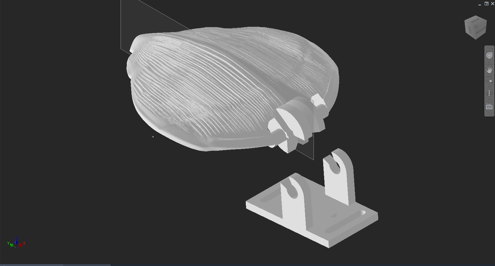
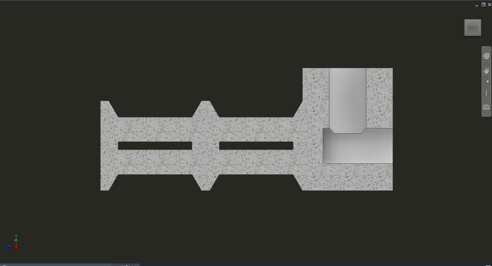
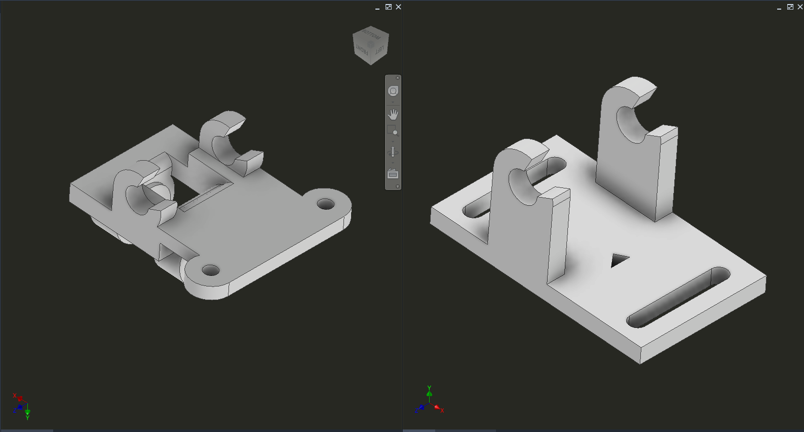
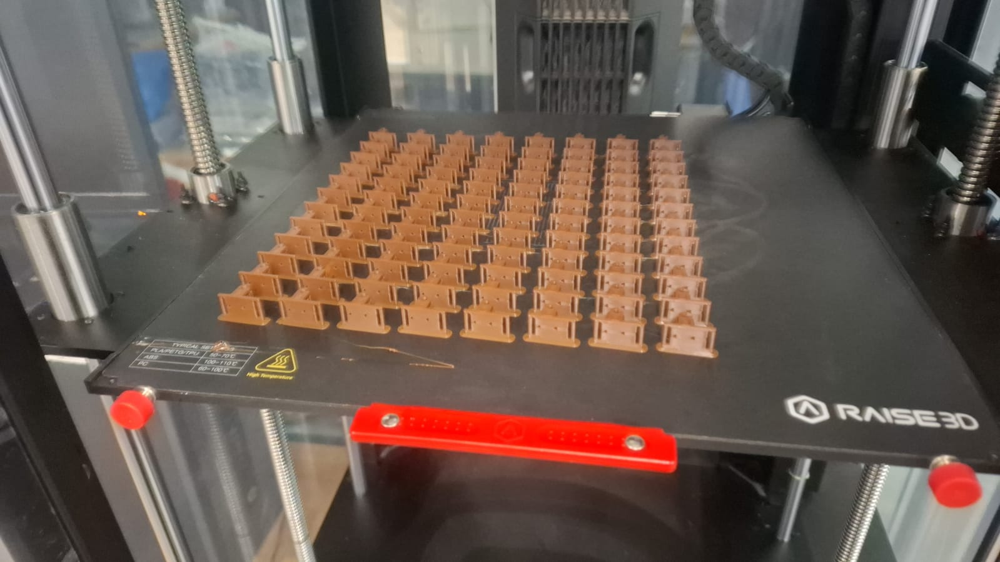
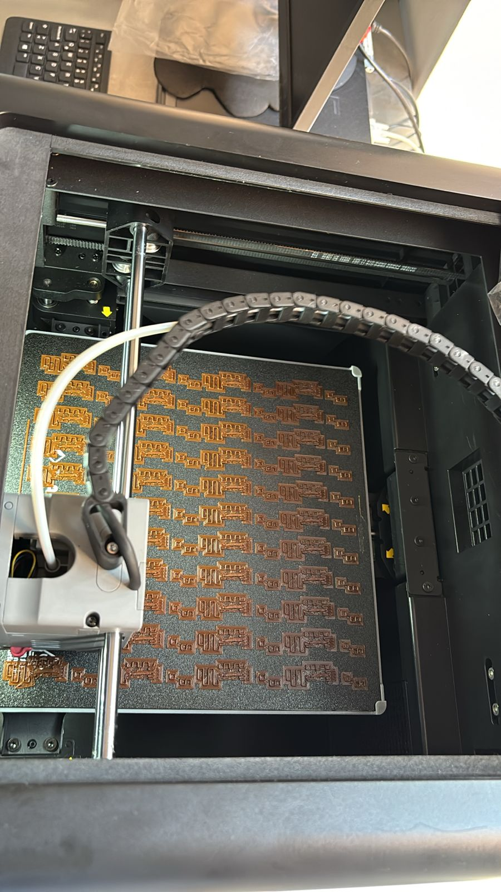
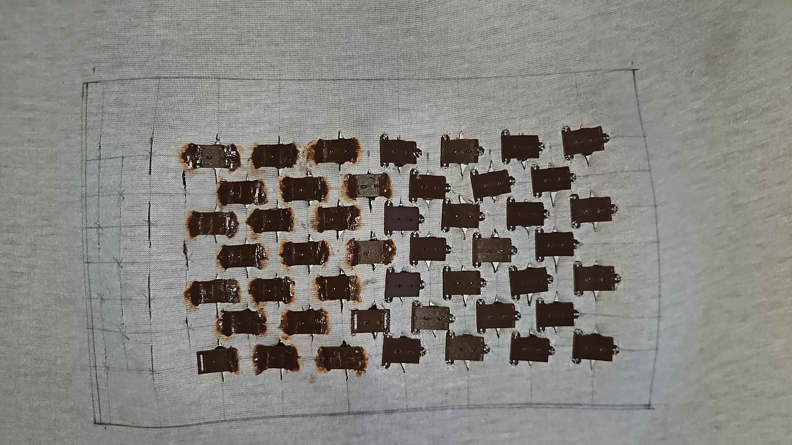

## 8. Evidencia Visual (Fotos y Diseño 3D)

En esta sección se presentan las imágenes que comprueban el trabajo realizado, desde el diseño en la computadora hasta la fabricación y las pruebas físicas. Cada imagen está acompañada de una explicación sobre su importancia en el desarrollo del proyecto.

### Mecánica Interna (Diseño por Computadora)

Para entender cómo se arman las piezas antes de fabricarlas, se generaron imágenes directamente desde el programa de diseño 3D (Autodesk Inventor).

* ****
* **Descripción de la evidencia:** Esta imagen muestra las piezas separadas (la base, la escama y el eje). Sirve para demostrar visualmente cómo la pieza móvil encaja a presión dentro de la base fija.
<iframe src="https://drive.google.com/file/d/1-8Ki7ztZvTfsFrFfMJg4N3FGN6wtAqqm/preview" width="100%" height="480" allow="autoplay" frameborder="0"></iframe>
* ****
* **Descripción de la evidencia:** Se muestra un corte por la mitad del carrete diseñado para el motor. Aquí se pueden ver los canales separados y las ranuras internas que se diseñaron para sostener los hilos antes de aplicar el pegamento.

### Evolución del Diseño (Versión 1 contra Versión Final)

El diseño de las piezas requirió cambios físicos para mejorar su funcionamiento. La siguiente evidencia muestra esta evolución.

* ****
* **Descripción de la evidencia:** En la primera versión se observan las ranuras que estaban pensadas para coser la pieza con hilo. En la versión final, estas ranuras ya no existen, mostrando una superficie inferior completamente plana y sólida, diseñada específicamente para ser fundida con calor directamente sobre la tela.

### Producción en Masa (Manufactura Aditiva)

Para comprobar el cálculo de las horas de trabajo de las máquinas, se documentó el proceso de impresión de las piezas.

* ****
* ****
* **Descripción de la evidencia:** Las fotografías muestran las camas de las impresoras 3D completamente llenas. Se observan los lotes de 44 escamas y 48 bases recién fabricadas. Esto comprueba la capacidad de producción masiva planeada para el proyecto.

### Unión Plástico-Tela (Anclaje Material)

Se documentó el resultado físico de la técnica utilizada para unir las piezas rígidas al material flexible sin usar pegamento.

* ****
* **Descripción de la evidencia:** La foto muestra cómo el plástico derretido penetró en la red de hilos de poliéster de la vinipiel. Esto demuestra físicamente que la unión es sólida y que el plástico quedó atrapado en el tejido al enfriarse.

### Evidencia del Fallo Físico (La Prueba de Estrés)

La siguiente imagen comprueba las razones físicas por las cuales la construcción de la armadura completa fue detenida.

* ****
* **Descripción de la evidencia:** Esta es la evidencia visual de la pieza rota. La foto muestra cómo el carrete de plástico se partió horizontalmente a lo largo de las líneas de impresión. También se observa la gran acumulación de los 70 hilos amarrados al plástico. Esta imagen justifica de manera visual que la fuerza del motor superó la resistencia del plástico impreso y expone lo laborioso que resultó el ensamblaje manual de las líneas de tensión.
